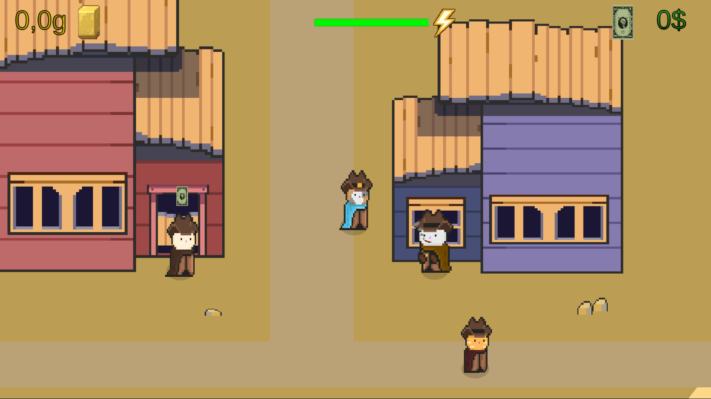
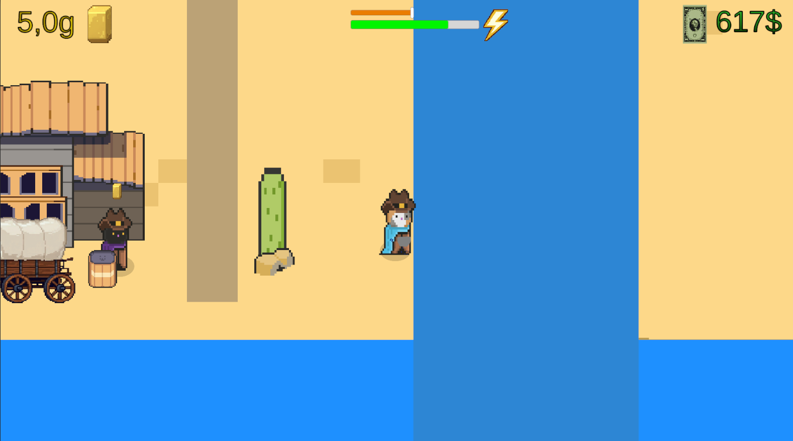
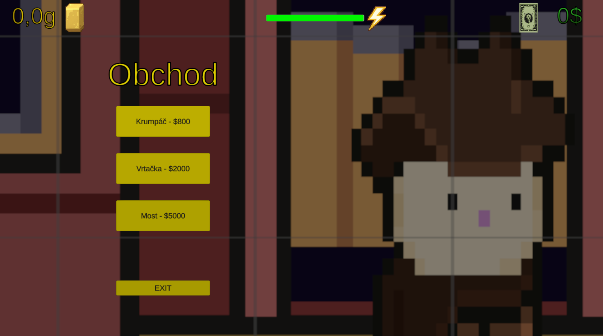
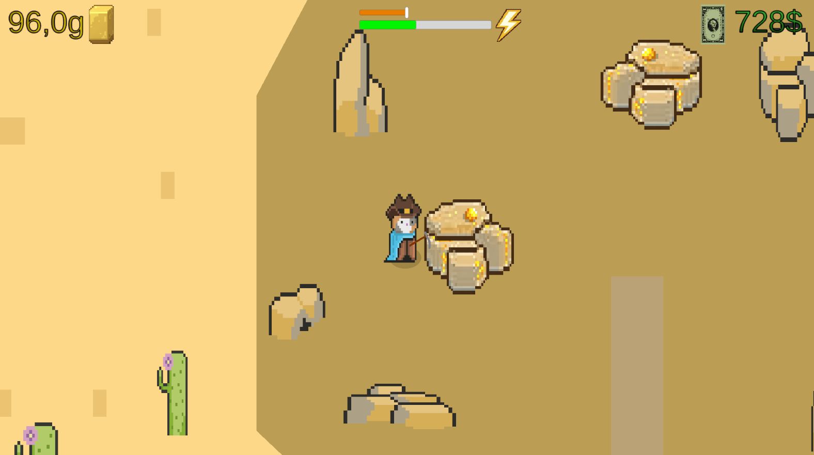

# SEM-prace-BCSH1

Semestrální práce – BCSH1

Varianta: (b) Jednoduchá počítačová hra

Student: Bartoň Jan st72463 

Git repozitář: https://github.com/bartja193/SEM-prace-BCSH1

**Původní vize hry**

	- Název hry GoldeWest
	- 2D Hra v prostředí Unity C#
	- Hráč těží zlatou rudu v dalších levelech i další suroviny, prodává suroviny na dynamickém trhu za měnu kupuje lepší nářadí pro těžení
	- později automatizované systémy na těžení
	- jídlo a místo na spaní.
	- 3 levely měnící se nástrahy rozpoložení surovin i nové suroviny
	- trh ovlivňovaný NPC obchodníky, konkurenční NPC soutěží o ploty/ložiska
	- Progres, peníze, odemčené úrovně a high score jsou ukládány
	- Plynulý pohyb hráče po mapě, animace těžení, prodávání a souboje

**Stav funkcionalit**

	- 🟩-téměř hotové/hotové

	- 🟨-prozatímní/rozpracované

	- 🟥-není hotové/plánované

	- Základní logika Hry - 🟩
	- systém Energie - 🟩
	- Jednoduchá AI - 🟩
	- Pokročilá AI - 🟥
	- Trh 🟨
	- 1 úroveň - 🟩
	- 2 úroveň - 🟩
	- 3 úroveň - 🟥
	- Animace - 🟨
	- Teleport mezi levely - 🟩
	- Nákup zaměstnanců (automatizace) - 🟩
	- PVE - 🟥
	- Nákup plotu/domu -  🟥
	- Systém resetu pro obdržení bonusu - 🟥
	- Vybalancování progresu - 🟥

	
**Screenshots**

**Použité technologie**

	- Jazyk: C#
	- Engine: Unity

**Assety**

	- Cowboys Cats 2D by MGLawless (Unity Asset Store)

	- Kenney.nl (CC0)

**Hudba**

	
	

**Tutoriály**

	- Character Animations tutorial (YouTube)
	https://www.youtube.com/watch?v=Zcl3QcNzgrk

	- 2D Top Down RPG (YouTube)
	https://www.youtube.com/watch?v=9zzUq6T-rtA\&list=PL6bqhqO0Ba776ksb3F9P\_xmUMT9WvmfFT

**Poznámky k licencím**

	- Všechny použité assety a hudba jsou používány v souladu s jejich licencemi.
	- Hra je vytvořena výhradně pro účely školní semestrální práce (nekomerční použití).

