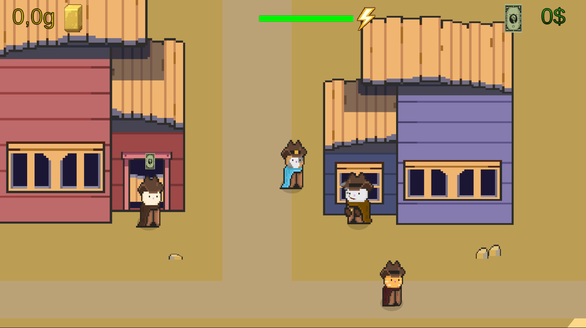
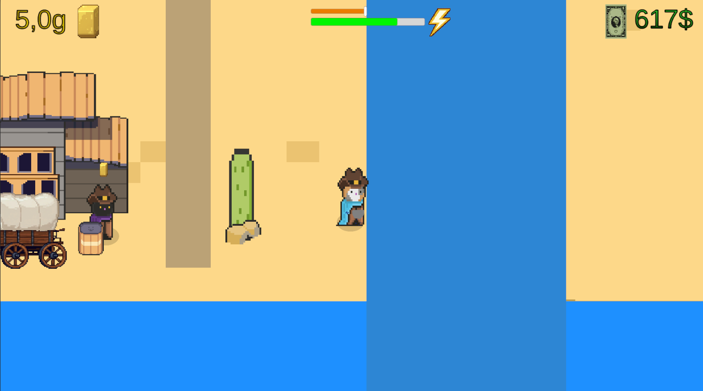
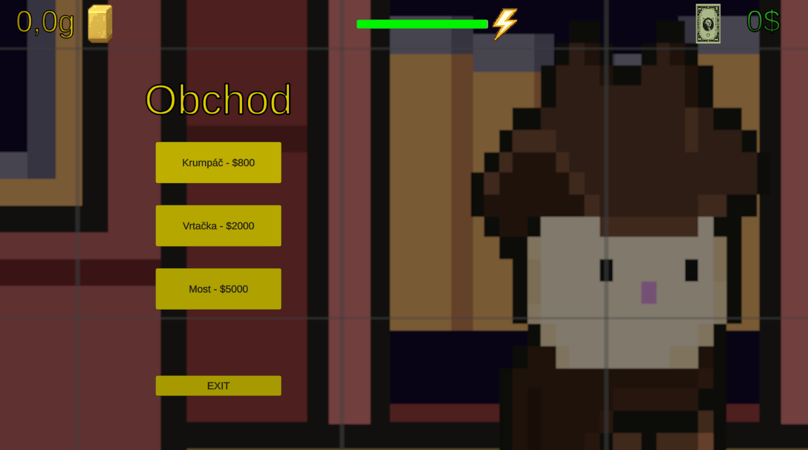
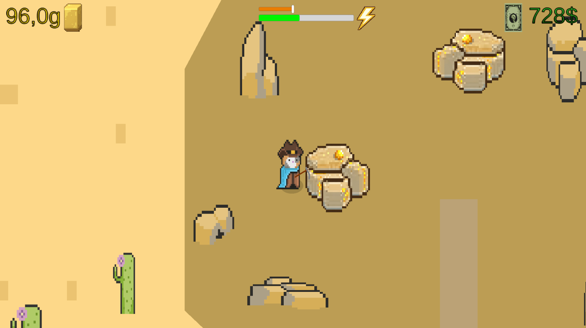
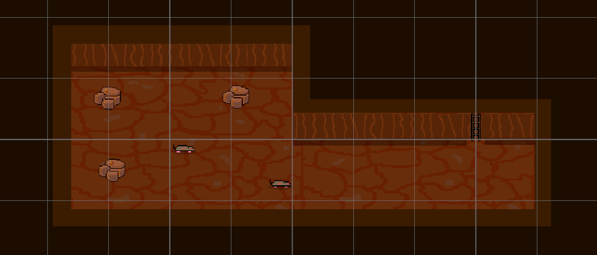

# SEM-prace-BCSH1

Semestrální práce – BCSH1

Varianta: (b) Jednoduchá počítačová hra

Student: Bartoň Jan st72463 

Git repozitář: https://github.com/bartja193/SEM-prace-BCSH1

**Původní vize hry**

	- Název hry GoldeWest
	- 2D Hra v prostředí Unity C#
	- Hráč těží zlatou rudu v dalších levelech i další suroviny, prodává suroviny na dynamickém trhu za měnu kupuje lepší nářadí pro těžení
	- později automatizované systémy na těžení
	- jídlo a místo na spaní.
	- 3 levely měnící se nástrahy rozpoložení surovin i nové suroviny
	- trh ovlivňovaný NPC obchodníky, konkurenční NPC soutěží o ploty/ložiska
	- Progres, peníze, odemčené úrovně a high score jsou ukládány
	- Plynulý pohyb hráče po mapě, animace těžení, prodávání a souboje

**Stav funkcionalit**

	- 🟩-téměř hotové/hotové

	- 🟨-prozatímní/rozpracované

	- 🟥-není hotové/plánované

	- Základní logika Hry - 🟩
	- systém Energie - 🟩
	- AI - 🟩
	- Trh 🟩
	- Levely, Dungeony - 🟩
	- Animace - 🟨
	- Teleport mezi levely - 🟩
	- Nákup zaměstnanců (automatizace) - 🟩
	- PVE - 🟩
	- Nákup plotu/domu -  🟩
	- Systém resetu pro obdržení bonusu - 🟥
	- Vybalancování progresu - 🟨

## Funkcionality

### Herní systém
- Hra na čas – hráč má 15 minut na maximalizaci zisku, který se pak uloží do tabulky
- Systém HP – hráč má životy, při smrti přijde o $500 a respawnuje na Level1
- Systém energie – těžba spotřebovává energii, doplňuje se spánkem nebo jídlem
- Pasivní příjem – zakoupení pozemků a najímání těžařů generuje zlato automaticky

### Těžba
- Rýžování zlata v řece nebo u žíly klávesou E s progress barem
- Řeka a žíly mají omezené zásoby, obnovují se spánkem
- Automatická těžba najatými těžaři na zakoupených pozemcích

### Ekonomika
- Dynamická cena zlata – mění se pomocí Perlin noise a supply pressure
- Prodej zlata obchodníkovi za aktuální tržní cenu
- NPC prospector který samostatně těží a prodává zlato, čeká na výhodnou cenu
- Zakoupení mostu pro přístup na druhou část mapy

### Obchody & Upgrady
- Obchod s nástroji – zlepšení rychlosti a síly těžby
- Obchod se zbraněmi – nůž, vidle pro boj s nepřáteli mění dmg ale i dosah útoku
- Gym – upgrady HP, DMG, Speed, Energy za peníze
- Barman – jídlo a pití pro doplnění energie

### Boj
- Nepřátelé s AI – detekují hráče, pronásledují, útočí na kontakt
- Dungeony – speciální bojové zóny s odměnou
- Útok hráče s dosahovou zbraní, cooldown systém

### Více scén
- Level1 – hlavní město s obchody, řekou a obchodníky
- Level2 – důlní oblast s pozemky a těžaři
- Dungeons – bojové zóny

### Ukládání dat
- Ukládání výsledků a high score do JSON souboru
- Perzistence dat mezi scénami přes DontDestroyOnLoad singletony

### UI
- HUD – zlato, peníze, HP, energie, časovač
- Kontrola Statů - pomocí klávesy Tab lze kontrolovat skryté stats
- End screen – zobrazení finálního zůstatku
- Lokální žebříček top 10 hráčů

**Screenshots**

**Použité technologie**
Jazyk: C#
Engine: Unity

**Assety**
Cowboys Cats 2D by MGLawless (Unity Asset Store)
Kenney.nl (CC0)

**Fonty**
PixelPurl Font - [License](https://www.1001fonts.com/licenses/ffp.html)

**Hudba**
Swamp_Showdown [License](https://www.fesliyanstudios.com/policy)

**Tutoriály**
Character Animations tutorial [YouTube](https://www.youtube.com/watch?v=Zcl3QcNzgrk)
2D Top Down RPG [YouTube](https://www.youtube.com/watch?v=9zzUq6T-rtA\&list=PL6bqhqO0Ba776ksb3F9P\_xmUMT9WvmfFT)
Unity Particle System Tutorial [YouTube](https://www.youtube.com/watch?v=Oo6ktMZzzhg)

**Poznámky k licencím**
Všechny použité assety a hudba jsou používány v souladu s jejich licencemi.
 Hra je vytvořena výhradně pro účely školní semestrální práce (nekomerční použití).

